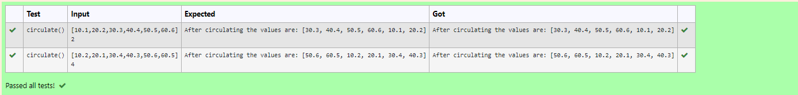

# Circulate-the-values-of-N-variables
## Aim:
To write a python program to circulate the n variables using function concept

## Equipment’s required:
PC
Anaconda - Python 3.7

## Algorithm: 
### Step 1: 
Defining a function

### Step 2: 
Get the value from the user for the number of rotation 

### Step 3: 
Defining datatypes for the input

### Step 4: 
Using the slicing concept rotate the list

### Step 5: 
Print the output

### Step 6: 
End the program

## Program:
```#Program to circulate N values.
#Developed by: Santhosh u
#RegisterNumber:22009224
def circulate():
    a=eval(input())
    n=int(input())
    print("After circulating the values are:",a[n:]+a[:n])
```

## Output:


## Result:
Thus the Circulate-the-values-of-N-variables are successfully executed